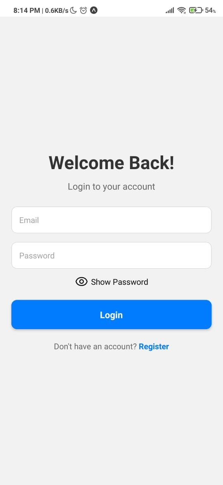
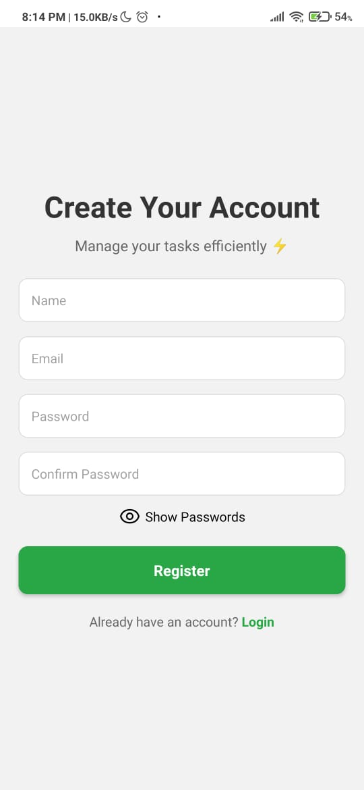
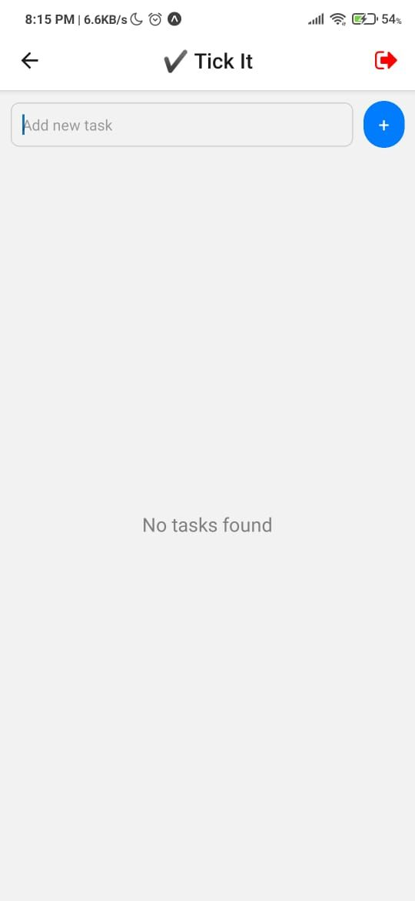
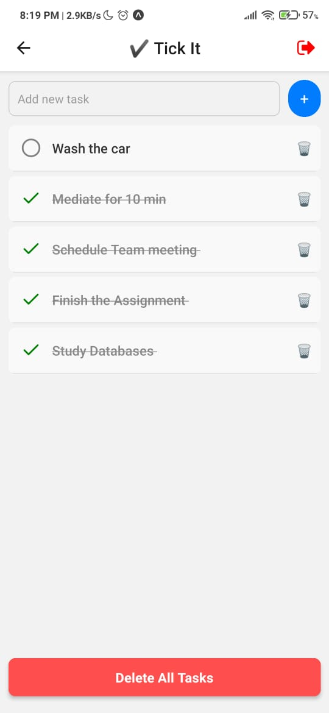
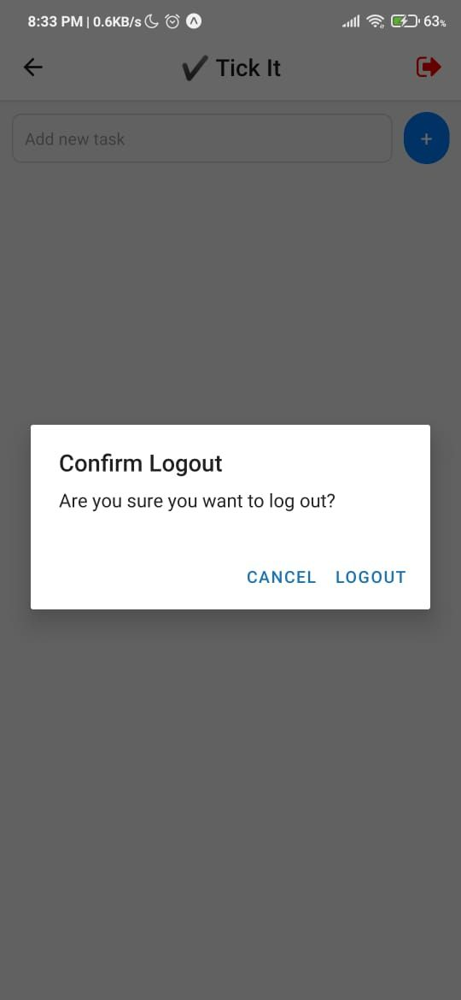
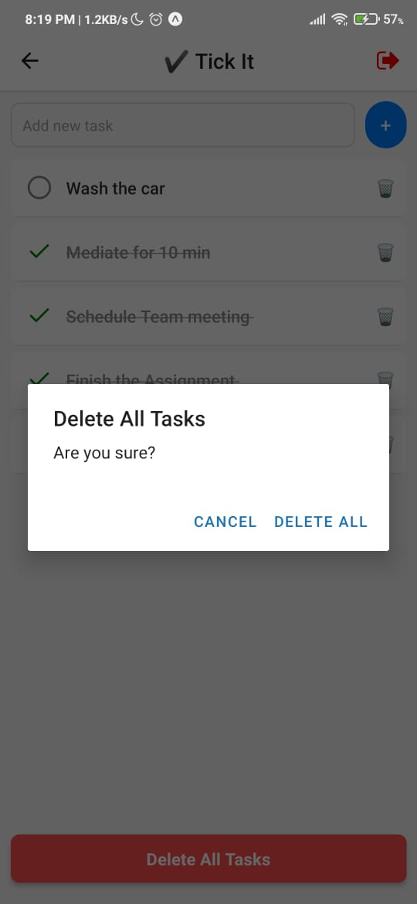
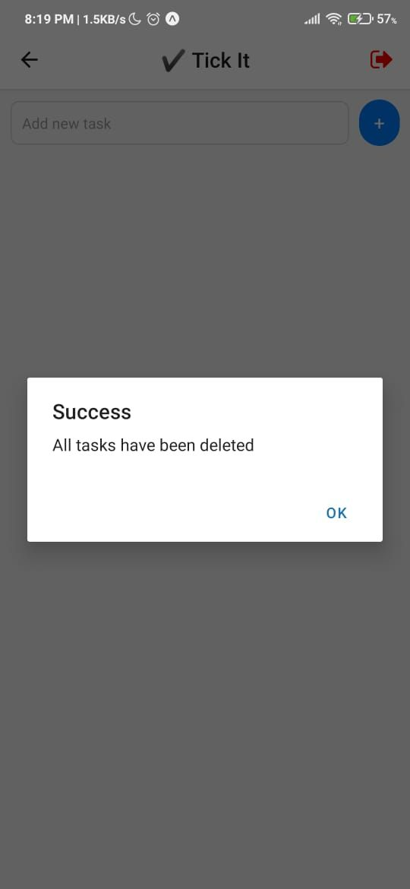

# 📱 To-Do App Mobile Documentation

This document provides detailed instructions for setting up, developing, and deploying the **To-Do List Mobile App**.

---

## 📂 Project Structure

```
mobile-app/
├── app/               # Screens and navigation
├── assets/            # Splash screen, icons, and images
├── src/               # Core application logic
│   ├── components/    # Reusable UI components
│   ├── context/       # Auth and global state providers
│   ├── services/      # API clients and integration logic
│   ├── utils/         # Utility functions
├── app.json           # Expo configuration
├── package.json       # Dependencies and scripts
```

---

## 🚀 Features

- **User Authentication**: Secure login, registration, and logout using JWT.
- **To-Do Management**: Add, edit, delete, and mark tasks as complete.
- **Responsive Design**: Works seamlessly on Android, iOS, and web.
- **Splash Screen**: A branded splash screen for professional app launch.
- **Reusable Components**: Modular UI for better maintainability.

---

## 🛠️ Setup Instructions

### 1. Install Dependencies
```bash
npm install
```

### 2. Start the Development Server
```bash
npm start
```

### 3. Run the App
- **For Web**: Press `w` in the terminal to open in a browser.
- **For Android/iOS**: Scan the QR code with the **Expo Go** app.

---

## 📸 Screenshots

### Login Screen


### Register Screen


### To-Do List



### Logout Prompt


### Delete All Tasks



---

## 📦 Build Instructions

1. Install `eas-cli`:
   ```bash
   npm install -g eas-cli
   ```
2. Build for Android:
   ```bash
   eas build --platform android
   ```
3. Build for iOS:
   ```bash
   eas build --platform ios
   ```

<!-- --- -->

<!-- ## 📄 License

This project is licensed under the [MIT License](../LICENSE). -->

---

## 🎉 Get Started Now!

Dive into the code and start building your own To-Do List Mobile App today. Happy coding! 🚀